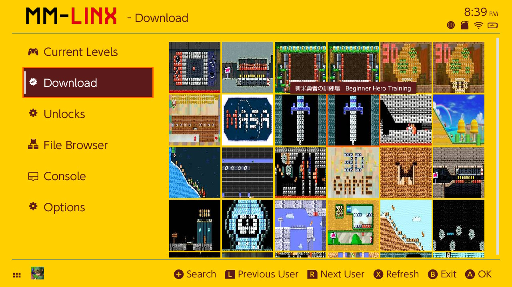
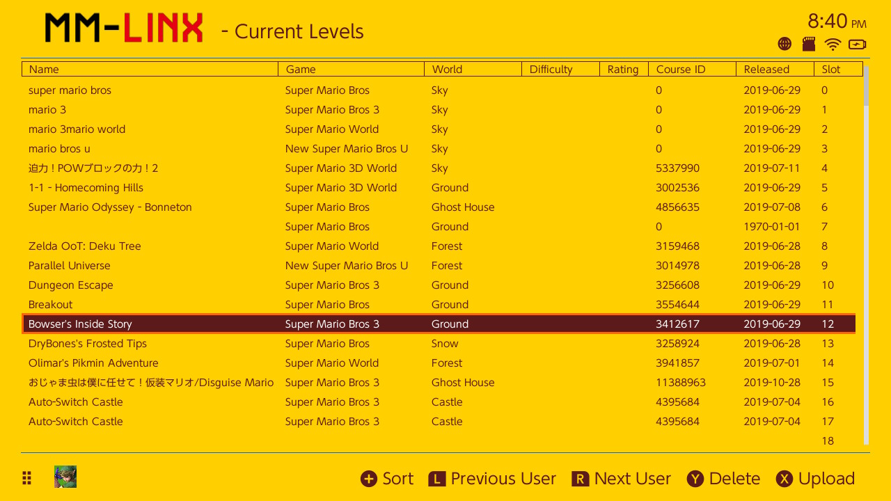

# MM-LINX

This application is for browsing and injecting custom user created Super Mario Maker 2 levels directly on the Nintendo Switch, for users who can run homebrew but cannot connect to the normal Super Mario Maker 2 Nintendo servers.

These levels are submitted by the community to https://tinfoil.io/mariomaker/

